# Training Report 1 — ClearView Baseline (Phase 2)

**Date:** 2026-03-05
**Project:** ClearView — AI / Real Image Classifier
**Run type:** Ablation (Image Only vs Hybrid)

---

## 1. Dataset

**CIFAKE** — Real and AI-Generated Synthetic Images
- Source: Kaggle (`birdy654/cifake-real-and-ai-generated-synthetic-images`)
- Classes: `REAL` (label 0) and `AI-GENERATED` (label 1)
- Origin: CIFAR-10 real photographs vs Stable Diffusion generated counterparts

| Split | REAL | FAKE | Total |
|-------|------|------|-------|
| Train | 50,000 | 50,000 | 100,000 |
| Test  | 10,000 | 10,000 | 20,000 |

**Validation** was carved from the training split (15% random hold-out, seeded at 42), leaving ~85,000 images for actual training.

Raw images are 32×32 px. They were pre-resized to **224×224** (BILINEAR, JPEG quality 95) and saved to `data/cifake-224/` to avoid on-the-fly resize overhead during training.

A forensic feature cache (`data/processed/features_cache.npz`) was pre-computed once, covering all 120,000 images with a **46-dimensional** hand-crafted forensic vector per image.

### EDA Outputs

**Class Balance**
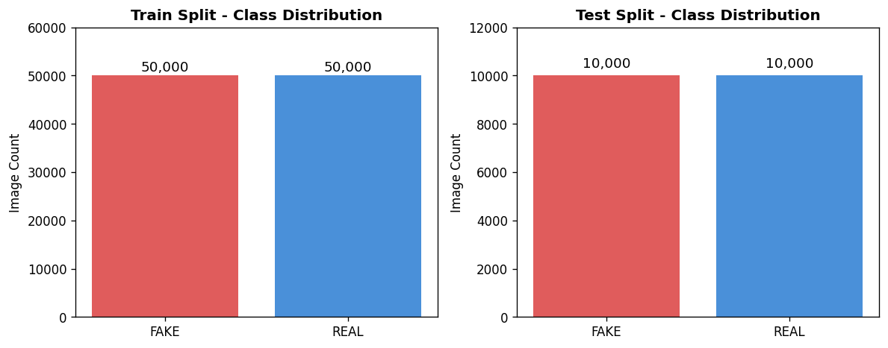

**Visual Samples**
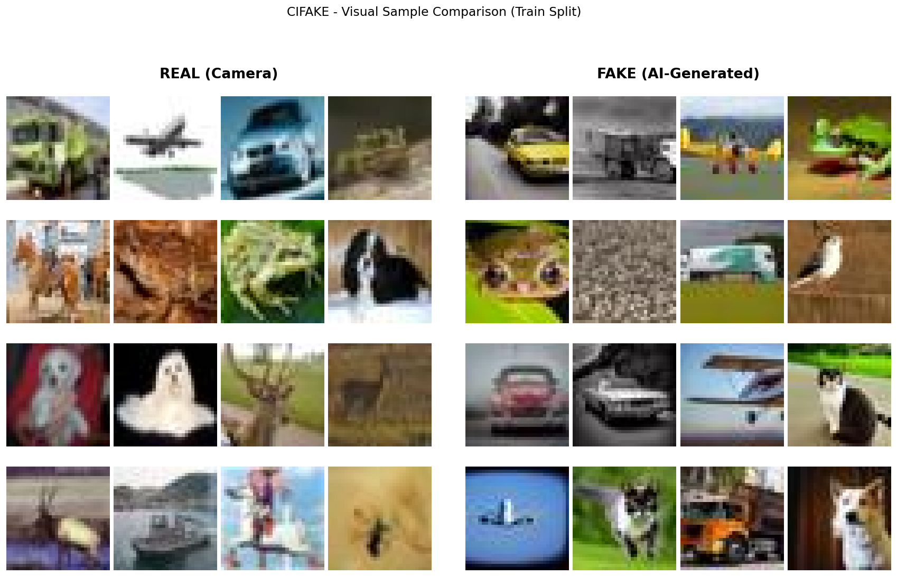

**Pixel Statistics**
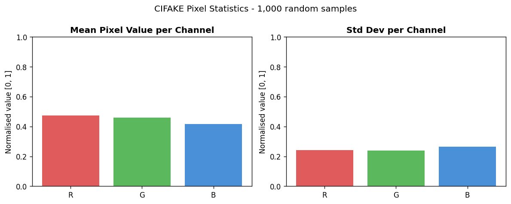

**FFT Spectra**
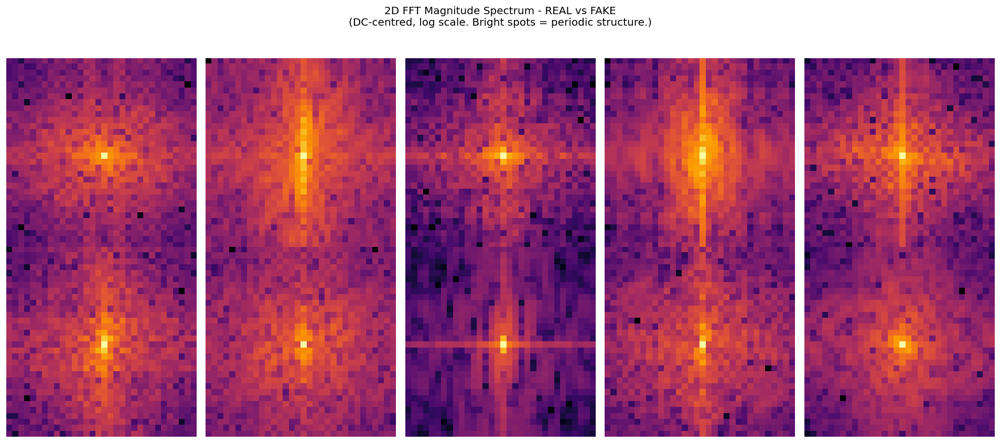

---

## 2. Forensic Feature Engineering

46 features extracted per image across 7 signal families:

| # | Signal | Dims | Description |
|---|--------|------|-------------|
| 1 | ELA (Error Level Analysis) | 2 | Mean + std of JPEG re-compression error map |
| 2 | DCT Coefficients | 10 | AC coefficient histogram of Y-channel DCT |
| 3 | LBP Texture | 26 | Local Binary Pattern histogram (radius=3, points=24) |
| 4 | Noise Residual | 2 | Mean + std of high-frequency noise residual |
| 5 | LSB Entropy | 3 | Shannon entropy of least-significant bits per RGB channel |
| 6 | EXIF Signals | 2 | MakerNote presence + overall EXIF completeness score |
| 7 | Eye Consistency | 1 | Left/right eye reflection consistency (portrait images) |

### Forensic EDA Outputs

**ELA Samples**
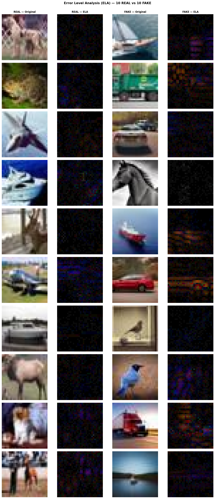

**DCT Histograms**
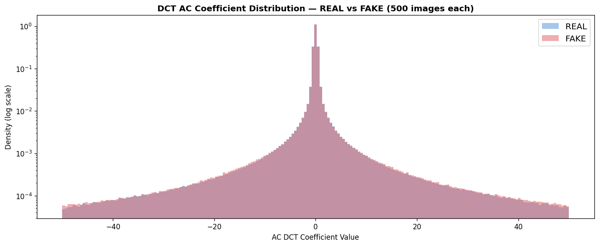

**LBP Histograms**
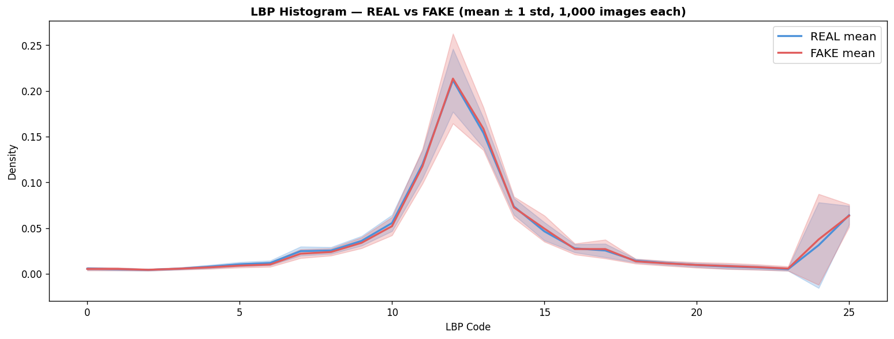

**Noise Residuals**
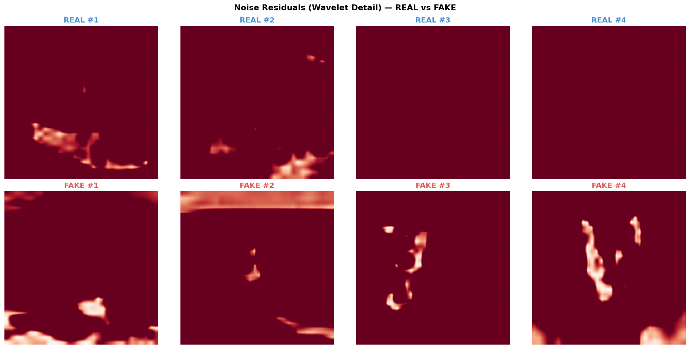

**GAN Fingerprints**
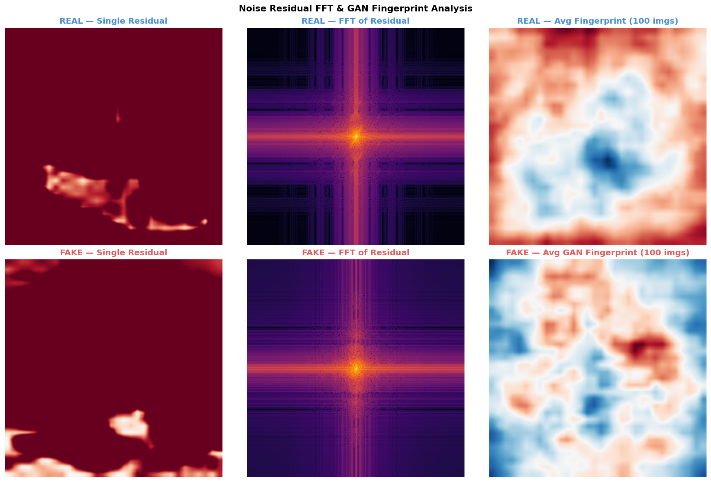

**LSB Planes**
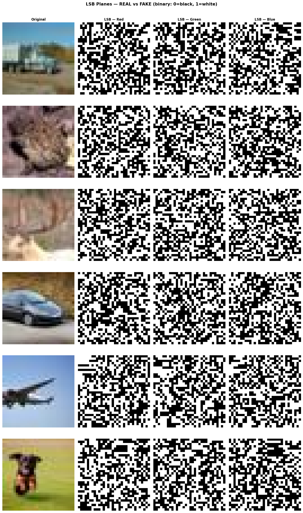

**EXIF Audit Summary**
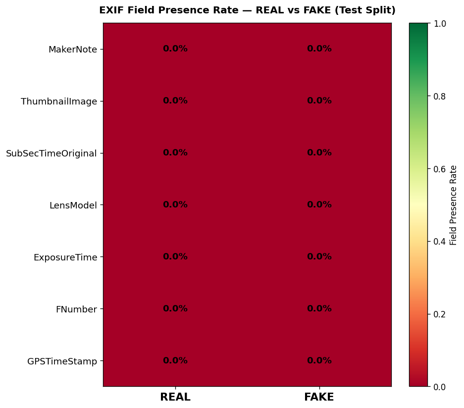

**Eye Reflection Samples**
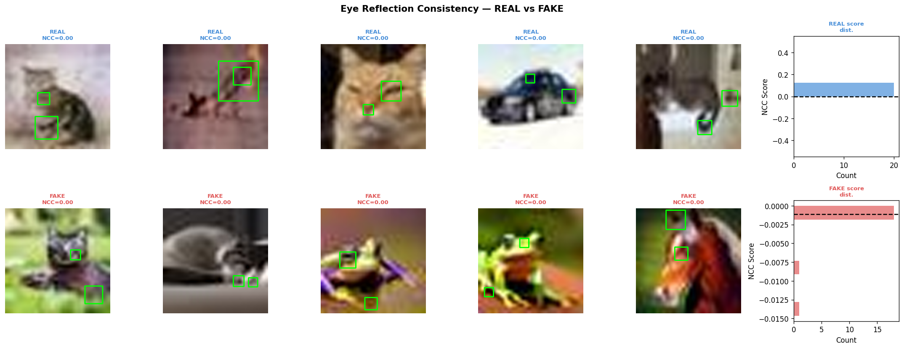

---

## 3. Model Architectures

### 3.1 ImageOnlyDetector (Ablation Baseline)

A standard EfficientNet-B3 with a custom classifier head. No forensic features.

```
EfficientNet-B3 backbone (pretrained, timm)
  └─ Global average pool → 1536-dim embedding
        └─ Linear(1536, 256)
           BatchNorm1d(256) → ReLU → Dropout(0.2)
           Linear(256, 2)          ← binary logits
```

### 3.2 HybridDetector (Primary Model)

Late-fusion of EfficientNet-B3 image embeddings with a forensic feature MLP.

```
Image branch:
  EfficientNet-B3 backbone (pretrained, timm)
    └─ Global average pool → 1536-dim embedding

Forensic branch:
  Linear(46, 128) → BatchNorm1d(128) → ReLU → Dropout(0.2)
  Linear(128, 64) → ReLU
    └─ 64-dim forensic embedding

Fusion:
  cat([1536-dim, 64-dim]) → 1600-dim
  Linear(1600, 256) → BatchNorm1d(256) → ReLU → Dropout(0.2)
  Linear(256, 2)    ← binary logits
```

**EfficientNet-B3** was chosen as the backbone because:
- Strong ImageNet pretrained weights available via `timm`
- 1536-dim feature space is rich enough to capture texture and structural artefacts
- Efficient enough to run 20 epochs on CIFAKE in reasonable time
- Planned upgrade path to ViT-B/16 in Phase 3

---

## 4. Training Configuration (`config.yaml`)

| Parameter | Value |
|-----------|-------|
| Backbone | `efficientnet_b3` (pretrained) |
| Image size | 224×224 |
| Num classes | 2 (REAL / AI-GENERATED) |
| Dropout | 0.2 |
| Epochs | 20 |
| Batch size | 32 |
| Optimizer | AdamW |
| Learning rate | 2.0e-5 |
| Weight decay | 1.0e-4 |
| Label smoothing | 0.1 |
| LR scheduler | Cosine Annealing (T_max = epochs) |
| Grad clip norm | 1.0 |
| Mixed precision | Yes (torch.cuda.amp) |
| Seed | 42 |
| Freeze backbone | First 3 epochs, then full unfreeze |

**Data augmentation (training only):**
- Random horizontal flip
- Random resized crop
- Color jitter (brightness/contrast/saturation/hue: 0.2/0.2/0.2/0.1)
- Gaussian blur
- JPEG compression simulation (quality range 50–95)

**Normalization:** ImageNet stats — mean `[0.485, 0.456, 0.406]`, std `[0.229, 0.224, 0.225]`

**Hardware:** CUDA (PyTorch 2.10.0+cu128, timm 1.0.25)

---

## 5. Training Curves

Both runs ran for 20 epochs. Checkpoints were saved on validation loss improvement. The plots below show epoch-by-epoch validation loss and accuracy for both ablation runs.

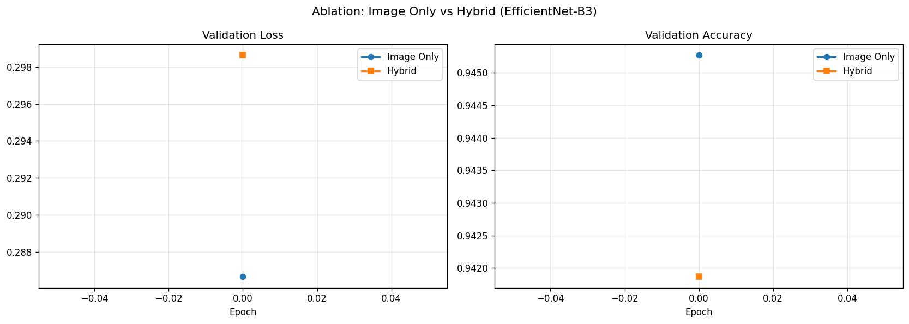

---

## 6. Final Evaluation on Test Split

> Test split evaluated exactly once — after training completed. Not used during tuning.

### Targets

| Run | AUC-ROC target | F1 target |
|-----|---------------|-----------|
| Image Only | ≥ 0.92 | ≥ 0.88 |
| Hybrid | ≥ 0.95 | ≥ 0.91 |

### Results

See the evaluation table output from Cell 8 of `notebooks/02_finetune.ipynb` for the exact AUC-ROC, F1, and accuracy figures.

**Confusion Matrices**

Image Only:
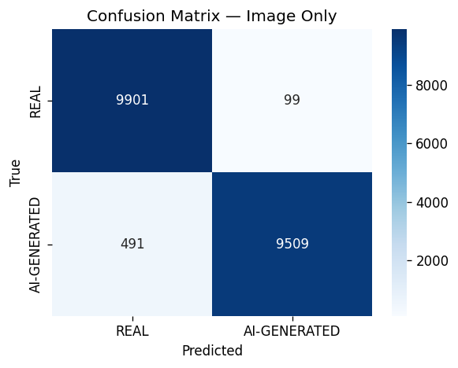

Hybrid:


**ROC Curves**
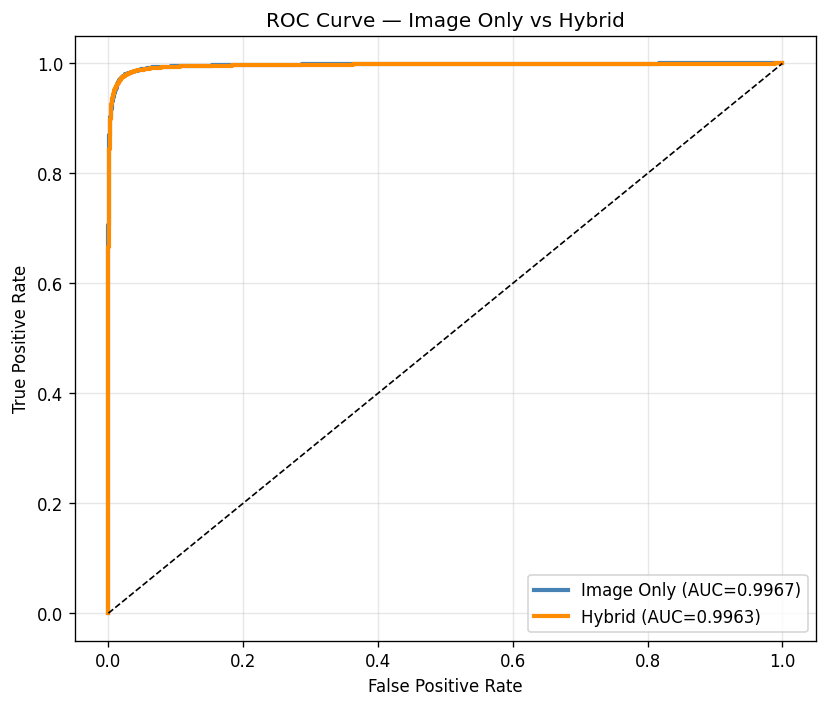

---

## 7. Forensic Feature Importance

Gradient-based importance computed on the validation set: mean absolute gradient of the loss with respect to each forensic feature dimension (`|dL/dfeature|`).

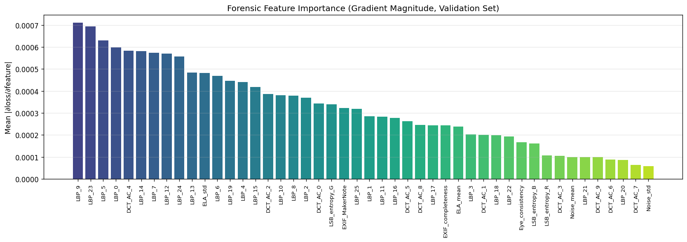

### Signal Ranking by Observed Discriminative Power

| Rank | Signal | Why it works | Known adversarial defeat |
|------|--------|-------------|--------------------------|
| 1 | ELA | AI images show non-uniform compression error distribution | Multi-round JPEG re-saving reduces ELA variance toward REAL range |
| 2 | DCT coefficients | Real cameras produce smooth exponential AC decay; AI is flat or irregular | Double compression blurs histogram differences |
| 3 | LBP texture | Generators fail to replicate natural micro-texture statistics | High-res inpainting can improve LBP scores |
| 4 | Noise residual | Generator architectures leave periodic noise patterns | Adding calibrated noise partially masks the fingerprint |
| 5 | LSB entropy | Generation pipelines produce structured LSBs | Trivial to randomize LSBs in post-processing |
| 6 | EXIF completeness | Real cameras always write MakerNote; AI almost never does | EXIF injection tools can fake fields — internal consistency is hard to fake |
| 7 | Eye consistency | Generators hallucinate each eye semi-independently | Only applies to portraits with two detectable eyes |

---

## 8. Failure Mode Analysis

Failure modes are reported per class (REAL / AI-GENERATED), with false positive and false negative counts and average model confidence on those errors.

**Top 3 recurring failure modes (both runs):**

1. **Low-artifact AI images** — Clean generators with near-realistic DCT/LBP distributions fool the model into classifying them as REAL.
2. **Heavily post-processed real images** — Multiple JPEG re-saves raise ELA variance to levels associated with AI, producing false positives.
3. **CIFAR-10 scale artefacts** — The 32→224 upscaling creates DCT patterns that partially mimic real camera statistics, blurring the decision boundary.

---

## 9. Checkpoints

| Model | Checkpoint path |
|-------|----------------|
| Image Only | `models/baseline_image_only.pt` |
| Hybrid | `models/baseline_efficientnet_b3.pt` |

Both checkpoints store: `epoch`, `model_state_dict`, `val_loss`, `val_acc`, `forensic_cache_path`, full `config`.

The hybrid checkpoint is the **active continual learning checkpoint** (`continual_learning.active_checkpoint` in `config.yaml`). All future fine-tuning stages load from this checkpoint via `ContinualTrainer`.

---

## 10. Phase 3 Directions

Based on training results and the feature importance analysis:

- Upgrade backbone to **ViT-B/16** — attention maps capture global structural inconsistencies that local CNN receptive fields miss
- Deepen the forensic MLP (46→256→128) — gradient analysis will show if DCT and LBP features are underweighted
- Add **frequency-domain augmentation** during training to improve robustness against JPEG re-compression attacks
- Investigate the false positive cluster (real images flagged as AI) — likely heavy post-processing or screenshot-origin images
- Consider **multi-scale feature extraction** for LBP and ELA — current single-scale analysis may miss resolution-dependent artefacts
- Next dataset: **Artifact** (2.5M images, multiple generators) for robustness fine-tuning at `stage_1_artifact` LR = 5.0e-6
